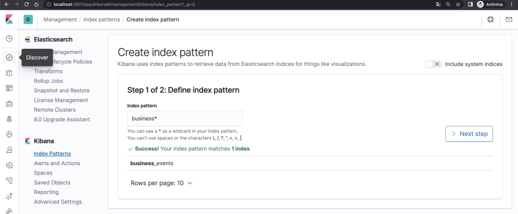

# Elasticsearch with AWS Lambda and SNS using LocalStack


This is an exercise and also a repository for testing using LocalStack, Elasticsearch, Kibana, AWS Lambda and SNS.

Initially it is a copy of the article [*Ingest data into Elasticsearch with AWS Lambda and SNS using LocalStack*](https://dev.to/jainec/ingest-data-into-elasticsearch-with-aws-lambda-and-sns-using-localstack-3af4) by Jaine Conceição, but I want to make new implementations in the future for studies and experiments.

Visit the article: https://dev.to/jainec/ingest-data-into-elasticsearch-with-aws-lambda-and-sns-using-localstack-3af4

---

## Start containers

Run the `docker-compose.yml` file:

```sh
$ docker-compose up -d
```

## Configure local SNS and Lambda

Creating the SNS topic

```sh
$ aws --endpoint-url=http://0.0.0.0:4566 sns create-topic --name events-topic
```

Creating the Lambda function

```sh
$ aws --endpoint-url=http://0.0.0.0:4566 lambda create-function --function-name events-lambda --zip-file fileb://function_lambda.zip --handler index.handler --runtime nodejs12.x --role _
```

Subscribing lambda to SNS topic

```sh
$ aws --endpoint-url=http://0.0.0.0:4566 sns subscribe --topic-arn arn:aws:sns:us-east-1:000000000000:events-topic --protocol lambda --notification-endpoint arn:aws:lambda:us-east-1:000000000000:function:events-lambda
```

## Testing

Sending a message to the SNS topic via command line:

```sh
$ aws sns publish --endpoint-url=http://0.0.0.0:4566 --topic-arn arn:aws:sns:us-east-1:000000000000:events-topic --message '{"name":"test", "user_id":1, "properties": {"nickname": "test-user1", "job": "Software engineer"}}'
```

Now access Kibana and make sure that you have configured the index pattern:



Then go to Discover section and your message should appear like that:


---

## Troubleshoot

### Install AWS CLI on Alpine Linux 3.15

```sh
$ apk add --no-cache python3 py3-pip
$ pip3 install --upgrade pip
$ pip3 install --no-cache-dir awscli

# Check installation
$ aws --version

# Output similar
aws-cli/1.25.7 Python/3.97 Linux/5.10.102.1-microsoft-standard-WSL2 botocore/1.27.7
```

### Error when starting elasticsearch container

> (...) max virtual memory areas vm.max_map_count [65530] is too low, increase to at least [262144]

Execute:
```sh
#https://github.com/docker-library/elasticsearch/issues/111
$ sysctl -w vm.max_map_count=262144
```
